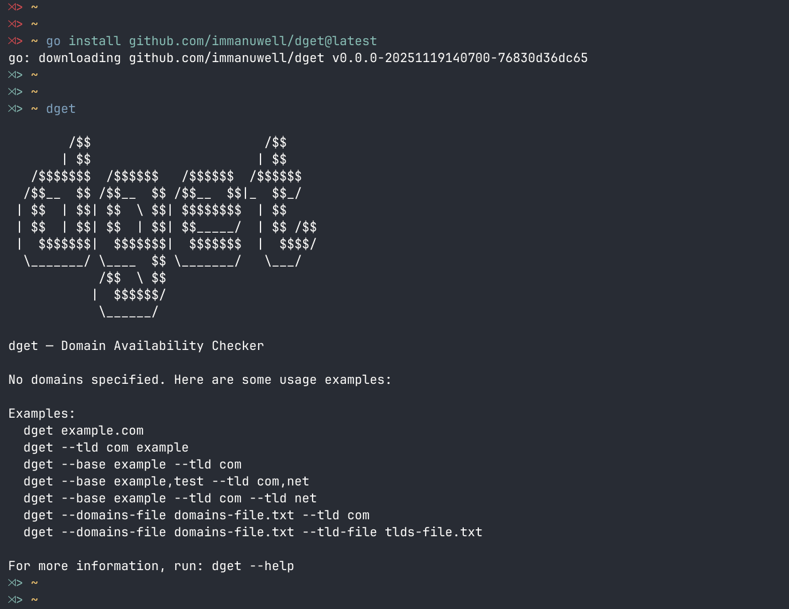
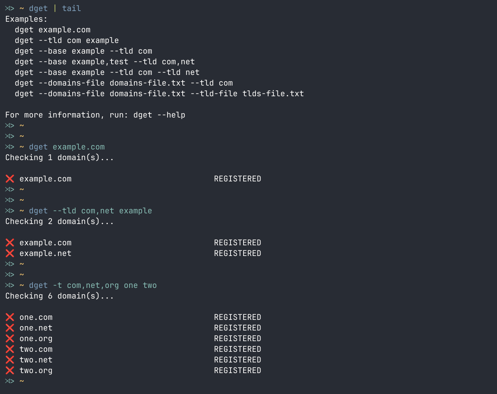
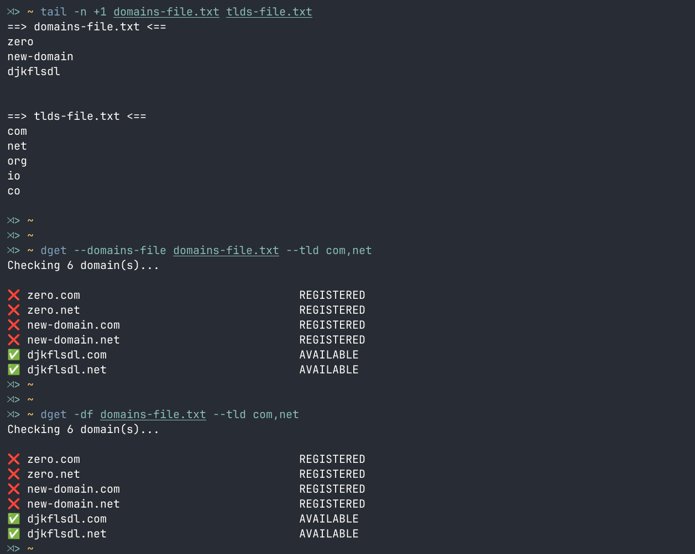
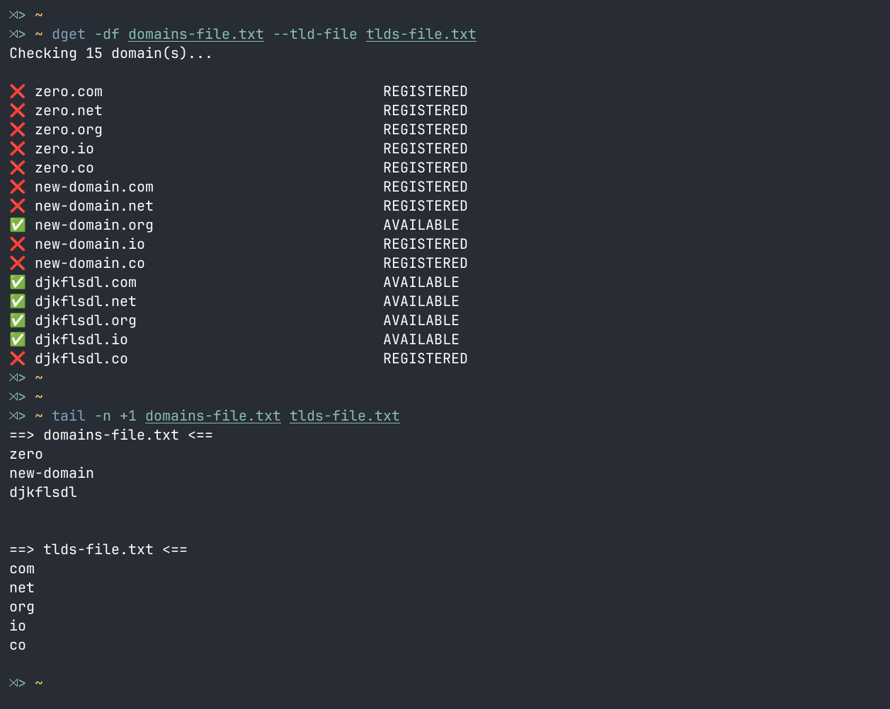

# dget — Domain Availability Checker


## Usage

```bash
        /$$                       /$$
       | $$                      | $$
   /$$$$$$$  /$$$$$$   /$$$$$$  /$$$$$$
  /$$__  $$ /$$__  $$ /$$__  $$|_  $$_/
 | $$  | $$| $$  \ $$| $$$$$$$$  | $$
 | $$  | $$| $$  | $$| $$_____/  | $$ /$$
 |  $$$$$$$|  $$$$$$$|  $$$$$$$  |  $$$$/
  \_______/ \____  $$ \_______/   \___/
            /$$  \ $$
           |  $$$$$$/
            \______/

dget [options] [domain]

Options (with shorthand):
  -b, --base <name>          Base domain name (can be comma-separated or used multiple times)
  -t, --tld <tld>            Top-level domain (can be comma-separated or used multiple times)
  -df, --domains-file <file> File containing base domain names (one per line)
  -tf, --tld-file <file>     File containing TLDs (one per line)
  -h, --help                 Show this help message

Examples:
  dget example.com
  
  dget --tld com example
  
  dget --base example --tld com
  
  dget --base example,test --tld com,net
  
  dget --base example --tld com --tld net
  
  dget --domains-file domains-file.txt --tld com
  
  dget --domains-file domains-file.txt --tld-file tlds-file.txt

File Formats:
  domains-file.txt:
    example
    test-domain
    mysite
    ...

  tlds-file.txt:
    com
    net
    org
    ...

```


## Installation

```bash
go install github.com/immanuwell/dget@latest
```

## Example of usage










## You can support me, if you want)

<a href="https://www.buymeacoffee.com/immanuwell" target="_blank"></a>


